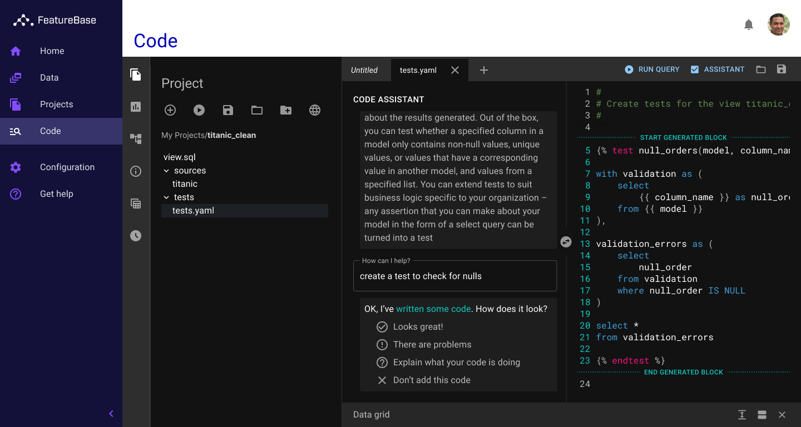

**My role:** Concept, designer  
**Lifecycle:** Speculative vision  
**Team size:** 1  
**Industry:** Data science, machine learning  
**Task:** Imagine what our product could become as an AI platform  
**Outcome:** Delivered and inspiring conversations

Just before the holiday break in December 2022, the executive team at FeatureBase asked me 
to help illustrate how our product could grow into a full-featured machine-learning platform. 
I offered to put together a visiontype; a speculative prototype intended to spark conversation 
and help stakeholders visualize the outcome of our strategic commitment to ML.

## My Process

**AI/ML Education Speedrun** - When I approach a new project, my first step is always research. 
Usually this means diving into technical documentation and looking for related projects on github. 
It quickly became clear that this approach would not work for ML; the field was complex, rapidly 
changing, and built on deep mathematical fundamentals. After a few false starts, I discovered 
[Jeremy Howard’s course](https://course.fast.ai/) and spent two straight weeks watching videos, 
spinning up colab notebooks, and back-filling my shaky linear algebra knowledge with 
[Josh Starmer](https://www.youtube.com/c/joshstarmer) and [Grant Sanderson’s](https://www.youtube.com/@3blue1brown)
excellent videos

**Market Research** - Once I had a handle on the core concepts, user tasks, and terminology, I 
could start making sense of the market landscape. Not surprisingly, my first stop was Gartner; 
while their taxonomies and analysis are often idiosyncratic, I find it helpful to have some 
starting framework. I zeroed in on their [“DSML engineering platforms”](https://www.gartner.com/reviews/market/dsml-engineering-platforms)
category, as it was closest to where our product was currently enjoying success. If we were to 
bootstrap this new vision, it would probably start by partnering with our current customers.

**Expert Interviews and Ethnographic Research** - I started this final step with a sort of 
internet ethnographic survey. I found the subreddits and stackoverflow topics most frequented 
by data scientists and ML engineers and started taking notes. I’ve found that users tend to 
be most transparent in these unguarded, semi-anonymous conversations, especially when those 
conversations stem from a moment of earnest frustration or confusion.

Finally, I was ready to start talking to some real humans. My first stop was our internal data 
scientist, who helped me sharpen up my questions and ground a lot of the theory in the daily 
experience of working with data. Next I set aside some time with a senior data scientist who 
helped me get a broader understanding of how ML tools were adopted and evaluated by businesses. 
Finally, I spoke with a developer friend who did not work on ML directly but integrated with 
his company’s ML systems. I wanted to understand the perspective of people who were working 
with these systems without formal ML training.

## My Findings

**The Market is Fragmented and Complex** - You only need to scan the [MAD landscape](https://mad.firstmark.com/) to 
understand the bewildering array of options available to teams who are building a machine 
learning stack for production. This is made more complex by competing preferences among data 
scientists; a common reason cited for switching jobs was the desire to work with a better 
software stack. This leaves data engineers struggling to connect legacy data systems, 
production software systems, and data science tools.

**Talent is Difficult to Source** - While my two-week crash course in ML equipped me to speak 
intelligibly about the work done by ML professionals, actually doing the work requires a deep 
understanding of the foundational math, broad knowledge of the comparative strengths of 
different algorithms, and constant learning to keep up with the latest academic research. 
Further, as executives come to realize the potential of ML systems, data scientists are in 
high demand; especially those who have experience working with production systems.

**Software Engineers are Underserved** - AI/ML systems are increasingly becoming a key part of 
business-critical software systems, and these new capabilities come with new risks. Teams which 
have traditionally built and operated software systems struggle to manage ML systems in 
production. Data scientists are not accustomed to the rigor of software engineering and 
reliability practices. [Software engineers struggle to master ML](https://pg.ucsd.edu/publications/software-developers-learning-machine-learning_VLHCC-2019.pdf)
and must rely on the data team to understand and mitigate operational risks. 

## Building the Visiontype

**Bringing in Everyone** - Not surprisingly, I was not the only person at the company with an
eye on AI/ML. I set up a series of meetings with key thinkers in the organization to understand
how they were thinking about our future. I learned that our developer relations manager was
working with LLMs to automate support, our VP of engineering  was investigating training and
deploying models in SQL and UDFs, and that one of our SEs had been researching data catalogs
for storing training sets. It was important to me that we could ground the visiontype in
actual work that was happening now.

**Identifying Key Features** - I wanted to help bring software engineers into the process and
integrate model training and inference into their normal software development practices. To this
end, I identified three key features:
- A consolidated data catalog. This would allow data engineers, analysts, and data scientists
to normalize datasets across projects. The data team could control access to ensure data integrity
and adherence to regulatory requirements. Engineers could trace the lineage of data to learn how
it's being cleaned and enriched.
- Github-backed data projects. This would normalize data work into something that could be 
integrated into existing CI/CD workflows. It would also allow team members to fork repositories
and perform experiments without adding new, persistent objects (stored procedures, UDFs) to a
shared database. Finally, including an integrated, multi-user IDE ([Monaco](https://github.com/microsoft/monaco-editor)
with [monaco-collab](https://github.com/convergencelabs/monaco-collab-ext) for instance) would
allow engineers to directly collaborate with the data team without the need for either to set
up a special local development environment.
- Coding assistance for unfamiliar frameworks. Not everyone will know the peculiarities of the
many libraries and frameworks in the modern data stack. I believe we could use LLMs (in the
fashion of CodePilot) to help engineers and data scientists ramp up on new frameworks and write
correct, idiomatic code quickly.

**Creating a Story** - I anticipated I would be called on to present the visiontypes in front
of audiences will different degrees of ML expertise. I decided to tell the story of a data engineer
wiring up the classic [Titanic survivor dataset](https://github.com/datasciencedojo/datasets/blob/master/titanic.csv),
performing some clean-up (the Titanic set has several well-known quality issues) and publishing a
project to clean and enrich the data. Our data scientist creates a new project (which references the
engineer's project) to train a simple decision tree model. Finally, our software engineer integrates
the data scientist's project into a versioned API. Our engineer wants to go back and improve test
quality, and the UI helps them author some robust tests using an unfamiliar data framework ([dbt](https://www.getdbt.com/)).

The story demonstrates a consistent way of organizing work from the initial data load to the final
integration with production systems. It empowers software engineers to understand the complete flow
of data and ensure the quality of the entire system. All without having to learn dozens of new tools
or very much linear algebra.
