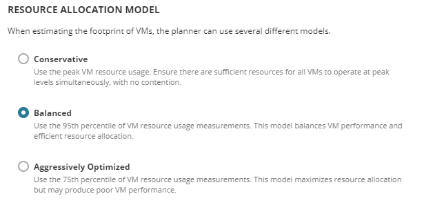

**My Role:** Design  
**Lifecycle:** Redesign of a legacy feature

The capacity planner is a long-standing feature of the SolarWinds 
Virtualization Manager product. It helps virtualization administrators 
plan the growth of their environments using statistical modeling of 
historic load. The feature had become incredibly complex, difficult to 
understand, and nearly impossible to demonstrate on sales calls. 

## The Problems

**Extensive Feature Set** - The capacity planner was developed as a side project 
by a back-end  engineer. Initially very simple, it slowly accumulated features 
to address customer edge cases. When that engineer left the company, no one 
was quite sure what many of the options and inputs did.

**Complex Problem** - At first blush, capacity planning for virtual machines is 
just a multi-dimensional bin-packing problem. However, the amount of resources 
consumed by a VM varies from moment to moment, which means users need to 
decide on their risk tolerance. 

**Infrequently Used** - Capacity planning is typically performed once a year, as 
part of an annual infrastructure budgeting process. Each time, the user must 
locate and learn the feature.

## Our Responses

### Catalog and  Cut

My first step was to build an inventory of every legacy feature. The engineering 
team had a test server set up, so I started there. When a behavior was unclear, or
didn’t seem to tie back to a use case, I reached out to our sales engineers. When
the SEs were puzzled, I asked our engineers to actually trace through the code to
figure out what a given control was doing.

Once I had oriented myself, I reached out to customers who were doing capacity 
planning. Some of them were using our product for this task, but most were using 
Excel. They had explored the capacity planner, found it confusing, and reverted to
their old techniques. Most of them only went through this process once each year, 
and it was easier just to struggle through it by hand than to learn a new product.

Once I had a grasp on the job users were performing, I sat down with the product 
manager and started looking for features to cut. There were a lot of behaviors that, 
while no doubt valuable for someone at some point, were now spandrels. They 
distracted users from the central task of capacity planning and added needless 
complexity.

### Simplify Confusing Choices

In many cases we were asking users to manually enter numeric parameters for the 
planner. Users were uncertain how these parameters affected the planner and what 
values were even sensible inputs. I collapsed many of these into simple, guided 
inputs.

In other cases, a value had a large impact on the planner, but the input was 
hidden in a row of assorted fine-tuning parameters. In these cases, I lifted the 
control out and unpacked why it was so important.

### Put a Wizard On It

The original capacity planner was a tabbed form/spreadsheet/dashboard hybrid. 
There is a place for this type of highly-interactive style, but only when the 
task is performed on a very regular basis. It’s like keyboard shortcuts; if you 
put the time into learning them for an app you use every day, the effort will pay 
dividends over time. If you’re only using the app every six months, it’s not 
worth the time to learn accelerators.

For capacity planning, I restructured the task into a wizard which produced a 
static report. The wizard reduced the cognitive load to one or two decisions per 
step. The report gave IT administrators something clean and professional to take 
to budget planning meetings to justify the new hardware they needed to purchase.

## Outcome

Virtual machine capacity planning is now a top-line feature of the Virtualization 
Manager product. User response has been broadly positive; the users in our tests 
were able to model out sophisticated scenarios and correctly interpret the produced
reports.

This has resulted in an uptick in work for engineering. Subtle flaws in the 
planning algorithm are now fairly transparent, resulting in some customer complaints
about anomalies. Likewise, as customers integrate our capacity planner into their 
annual budgeting process, they’ve started to ask for new features and more control 
over the content of the reports.

## One Detail

When talking with our existing customers and sales engineers, we heard three very common complaints:
- There were too many options and users weren’t sure where to start.
- It wasn’t clear which subset of features were necessary to model out a particular scenario.
- Many users were unaware of important capabilities that we had built into the product.

I believed all three of these could be addressed by adding an extra step to the wizard.
- The user is presented with a  simple, concrete choice expressed in the language of the problem they’re here to solve.
- The user’s choice on this screen determines which features we reveal during the wizard. If the user is not simulating additional host computers, we can skip that entire modeling task.
- The screen educates the user on the purpose and breadth of the feature.

The screen is mostly just text. No infographics. No embedded video. No cool interactions.

I’ve found  careful use of text to be  an essential tool for moving the user into a 
specific frame of reference. I’ve often heard the glib mantra “users don’t read,” and 
that’s certainly true to an extent. Users will chunk and skip what looks like boilerplate 
text, superfluous titling, and front-loaded tutorials. Brief, carefully-worded text gets 
read and gets integrated into the user’s mental model.
