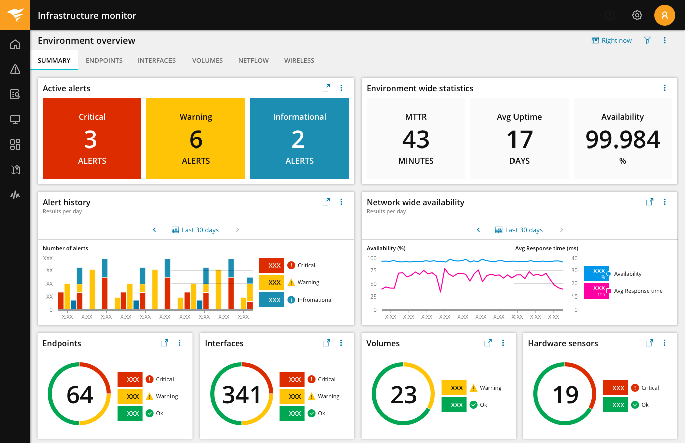
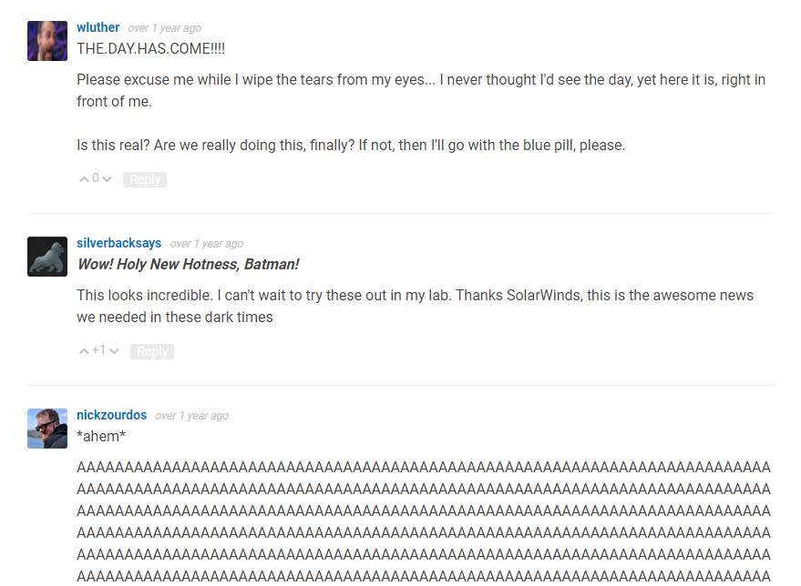
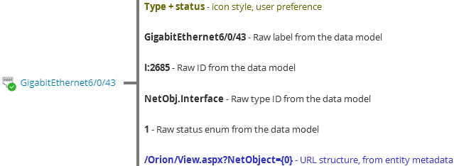
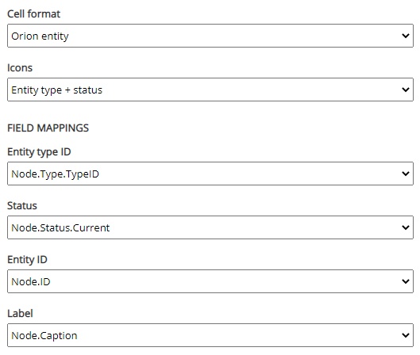
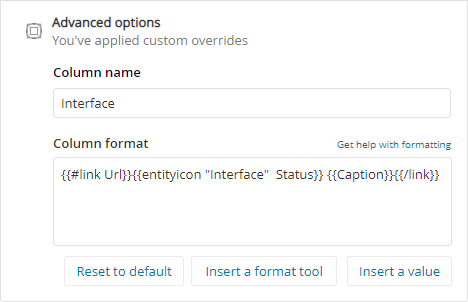

**My Role:** Concept, Design  
**Lifecycle:** New framework

Nova dashboards is a framework developed to replace SolarWinds legacy dashboards. Construction was halted after the discovery of the Sunburst attack and the subsequent re-allocation of engineering to securing the build pipeline and auditing existing code.

## The Problems
**Maintainability** - The legacy dashboard system implemented each widget as a distinct bundle of code, packaged and distributed with a related product. This meant widgets were difficult to normalize, difficult to re-style, and difficult to fix.

**Time to Market** - The legacy dashboard system required shipping a new build of a product in order to deliver a new view. This made it difficult to respond to changing market conditions and to deliver incremental functionality to close deals.

**API Proliferation** - Traditionally, the SWIS data API was the only approved way to access our data. Due to acquisitions and new purpose-built APIs, the dashboard system needed to support querying and presenting data from many sources.

## Our Responses

### Widget Shapes

We performed an inventory of our 400+ legacy widgets and normalized them into six basic types:

- KPI widgets deliver a single, high-impact value. A practitioner should be able to immediately reason about the implications of the value with no further evidence or explanation.
- Timeseries widgets display measurements over time. The practitioner should be able to zoom in and out to analyze unexpected values or locate larger trends.
- Proportional widgets use a donut, pie chart, or bar chart to divide a set of objects into multiple groups and compare the sizes of those groups. Table widgets are a familiar way to organize lists of objects along with key properties of those objects.
- Map widgets display user-created topology maps, a popular way for practitioners to reason about the structure of their environment. Inventory widgets allow users to locate monitored devices, either by search or by browsing a relationship graph. Each widget shape is a block of code. The shapes can be extensively customized to support a wide variety of business needs. Everything is Content

All users (including SolarWinds developers and community content creators) use the same built-in editor to create dashboards and define widgets. This means any user can inspect a widget to learn how it works and then copy and remix it.

If a user composes a particularly useful dashboard or widget, they can share it with the larger community and join the ranks of content creators. SolarWinds marketing, and product management can respond to emerging competitive threats by rapidly creating and delivering new dashboards. Sales engineers can create a bespoke dashboard to tell a story about how we solve a difficult customer problem.

### An Agnostic Builder
The built-in editor has a clear separation between the task of defining a data model and configuring presentation.

A data model includes instructions for querying a particular API, retrieving a set of data, and normalizing that data. Individual API providers must supply tailored screens which plug into the widget configuration process. The API plugin gathers any data needed to perform the query and formats the output into something usable by our dashboard system.

Presentation is about taking a raw result set and turning it into legible controls. This includes mapping the result set to elements of the widget, determining how numeric readings are presented, and generating links to other parts of the product. The separation of data and presentation configuration allows a single presentation codebase to show data from any supported backend.

## Outcome

We released an incomplete preview of Nova dashboards for our core products in April of 2020. Reaction from the community was quite positive, but adoption has been slow due to the limited set of released features.

In December of last year SolarWinds discovered a major security breach in our build pipeline (Sunburst). Feature work was frozen at that time as the company pivoted to protecting our customers and rebuilding confidence.

## One Detail
The smallest unit of presentation logic is what I’ve termed a “formatter.” A formatter is a recipe for extracting values from a result set and turning them into markup. In some cases, this is quite simple:

In other cases, the mapping can be quite complex:

         
In the example above (a link to a monitored object), we want to provide a lot of information scent to the user. Leaving the current research task and moving to a new page is expensive, especially if the origin page loses state related to your ongoing task.

To present the required information, the formatter needs to know where to find all this stuff in the data model. The initial approach was to create an “entity link formatter” which prompted the user to supply data for the various required fields:

I wanted UX to maintain an approved set of formatters. This would enforce consistency across our many products. If a product needed a unique variant, we would review the request and carefully integrate the new use case into the formatter logic.

In practice, I found this process was too slow. It created a bottleneck which slowed delivery of new dashboards. It also created complex chains of development interdependency. Multiple teams may need minor variations on one formatter and may need to ship the formatter on different schedules. This meant both development and UX had to maintain multiple versions of a formatter and keep track of which behaviors were shipped with which release.

In response to these problems, I reworked formatters to be defined in Handlebars:

This is admittedly less user-friendly. If you’ve never worked with Handlebars it can be daunting to build functional, syntactically valid markup. It also makes it more difficult for UX to enforce consistency across the product.

However, in this case I believe the benefits to the business outweighed the UX cost. Product teams can move faster and content creators can build new experiences for problems that we never considered. We traded a better moment-to-moment experience for the larger benefit of a rich, evolving ecosystem of dashboard content.
