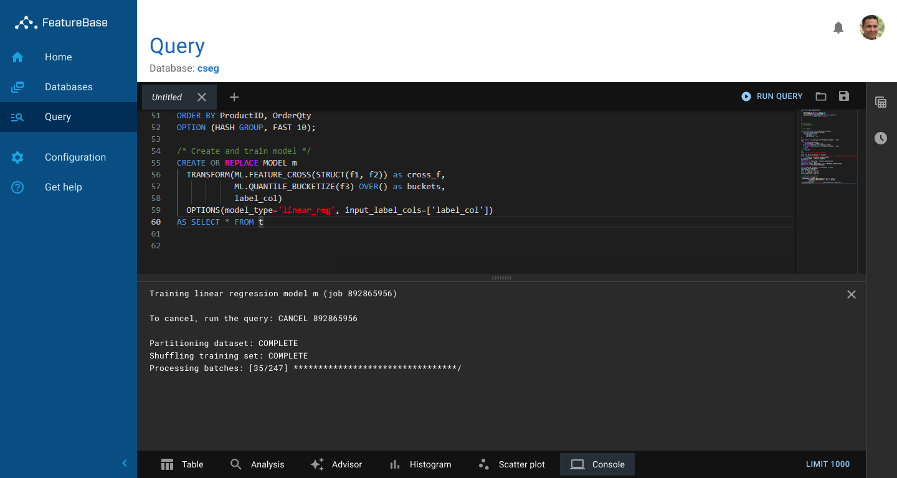

**My Role:** Design Leader  
**Lifecycle:** New product, new practice

[FeatureBase](https://github.com/featurebasedb/featurebase) is a high-performance, open-source database built on bitmaps. I joined as the first designer with the mandate to establish a design practice and design the company’s commercial product.

## The Problem

**High Table Stakes** - As a new entrant in a mature space, users were evaluating FeatureBase against products with a very rich feature set. We could not hope to replicate those features with our team and time horizon. But we still needed a broad foundation of core features to be taken seriously as a competitor.

**Flying Solo** - I was the first designer at FeatureBase, and much of my time would be devoted to foundational design work, defining strategy, performing user research, and running design thinking exercises. I would need to look for force multipliers to stay on top of routine interaction design work.

## My Reponses

### Logic Design System

Design systems are typically an alignment tool for design teams. In my case, I was the entire team. I still prioritized creating a minimal design system for a few reasons:
- It empowered developers to make good choices. I knew it was unlikely that every UI change would be funneled through me. I wanted to make sure developers could make user-friendly decisions on their own.
- It established an independent source of design authority. I wanted our core design principles to be transparent, clearly stated, and open to debate. I wanted inconsistent work (including my own) to be called out for violating our shared standards, not just for offending my design sensibilities.

Logic exists as a Figma component library, a React control library, and a GitHub Pages repository which documents our core principles.

[The Logic website](https://molecula.github.io/logic-docs/) is public and available to our open source community.

### Lightweight Process

I knew that bringing the entire design process from SolarWinds would be a disaster. That process was built for a big-design-up-front model with nine-month release cycles. However, I also knew that developers work best when they have a fixed, well-considered specification. I established three levels of “work-readiness:”

- Nothing in Figma is ready for comment or construction. Feel free to jump in if you want to peek at what’s coming next or see what I’m up to. Think of it like walking over to my office.
- Designs in Zeplin that are tagged **In Review** need your help. Please comment, start a discussion in Slack, send me a telegraph, whatever works for you. This is the time to look for problems.
- Designs in Zeplin that are tagged **Blessed** are ready to work. Product management and architecture have signed off on these. They’re not a death pact, but they’re a really safe starting point.

I initially held weekly meetings to bless new designs. However, this was not ideal for developers. Occasionally designs would need to go from concept to blessed in a few days, making the weekly meeting too slow. Developers were also stretched thin; adding another meeting to their calendar was a burden. Now most reviews and blessings are done as Slack threads.

### Leveraging Libraries

Over the last year I’ve become very familiar with Google’s Material UI library, the CodeMirror editor component, and Nivo charting. Much of the Logic design system simply encodes:
- This is how we compose a set of third-party components into a screen
- Here are the configuration options we use for each component, depending on the semantic context
- These are components and features we have intentionally chosen not to use

As a designer, it’s always fun to think of new ways to solve problems with clever microinteractions. Everyone wants to build a better datetime picker. However, because we had such an enormous feature gap to cover, I chose to focus on ways to make building screens faster and more predictable.

### Outcome

FeatureBase remains an ongoing project. After some initial missteps and over-corrections, our process is now running smoothly. Engineers have developed a good sense of when it’s necessary to seek mockups and when they can just rely on the guidance in the design system. 

We're still negotiating small details. Sometimes non-compliant work makes it into the product. Sometimes engineers are frustrated with having to wait for design to go through the process for a new screen. But I believe we will settle into a functional routine given time.

## One Detail

As a designer, you often have space blocked out for a table or datagrid or chart, but at runtime there is no data to fill it. The worst option, of course, is to just leave the space ambiguously empty. The best option is to attempt to diagnose the problem and offer tailored remediation advice.

I opted for a middle ground: whenever we would show an empty control, we would instead fill the content area with one of six classes of message:
- **Good, Actually:** in some cases (like alerts or faults) no news is good news. In this case we show an encouraging message.
- **Configuration Required and Encouraged:** a very typical situation for a new user. We want to show something, but the user needs to perform some action first. We guide the user to perform the necessary actions. We show this state for steps that are in the critical path for new user success.
- **Configuration Required but Optional:** similar to the previous, but users can come back to these items later. Relaxed language, less prominent CTA.
- **Excluded by Filter:** if a control can be filtered or the time frame can be changed, it’s possible to exclude all data. We encourage the user to adjust their filters so we can show what data we do have.
- **Access Denied:** we keep this message sparse to avoid leaking details of our security model. We encourage the user to contact their administrator for help.
- **Unexpected Error:** sometimes it’s just a 500. We try to be a bit humble, own the error, and offer a button to contact our support.

There are two versions of this control; a roomy version for full-screens and a compact version for panels and dialogs.

