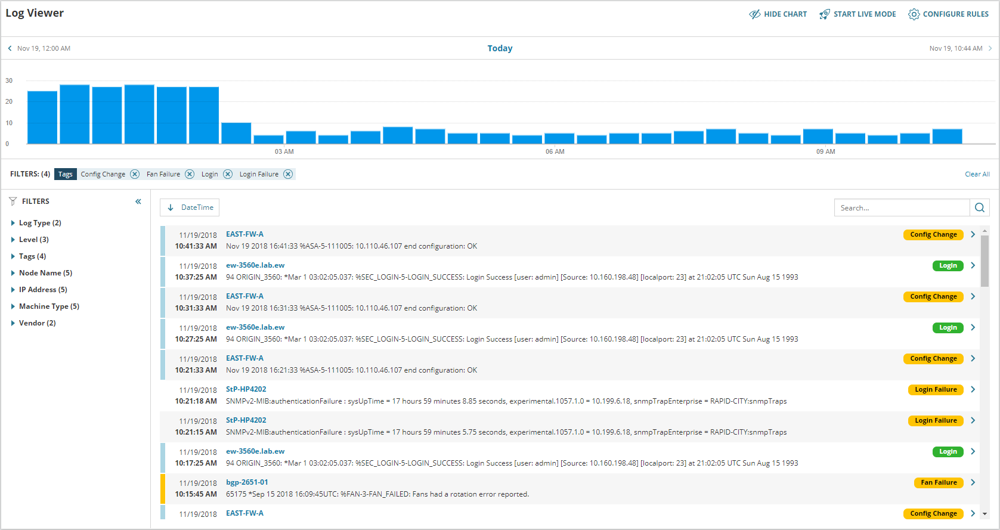
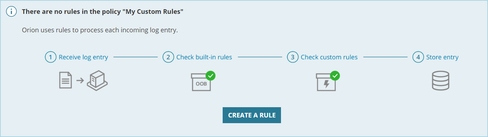
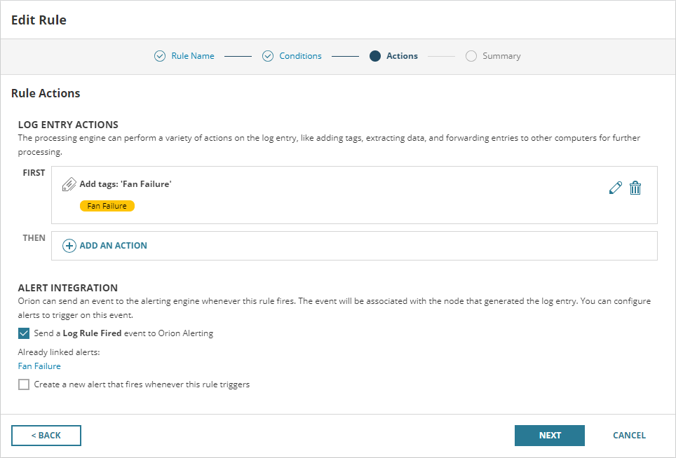
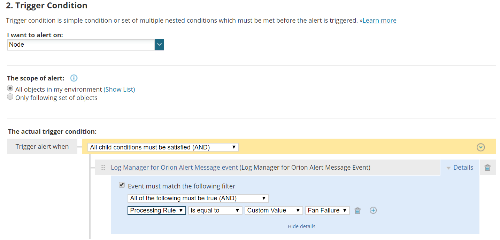
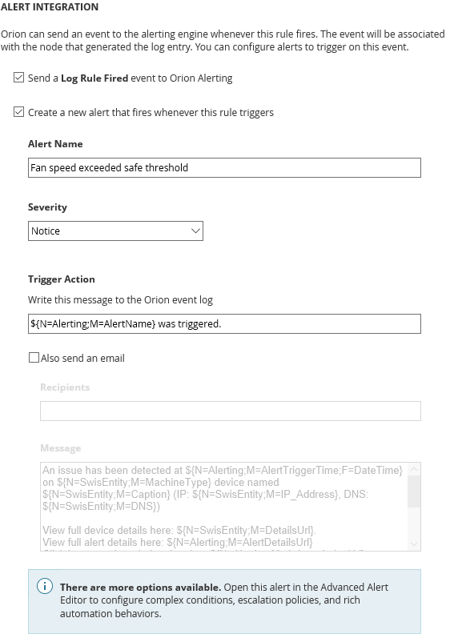

**My role:** Design lead  
**Lifecycle:** New product  
**Team size:** 8  
**Industry:** IT observability  
**Task:** Design a logging product with broad capabilities but a small resource footprint  
**Outcome:** The free version is now bundled by default with core SolarWinds products

SolarWinds Log Manager is a research tool for machine-generated
messages. IT administrators are responsible for maintaining servers,
applications, cloud services, telephones,PCs, and network devices. All of
these things generate short text messages confirming their health,
reporting task completion, and occasionally reporting errors or failures.
We believed there was an opportunity for a new product to help users
make sense of this flood of information.

## The Problems

**Strong Competitors** - IT log management is a very crowded space. We
had to contend with Splunk (a $14B goliath), dozens of SaaS offerings,
and ELK (a popular open-source solution). Platform vendors, like
VMware, Red Hat, and Amazon have released their own log products
with strong ties to their ecosystem.

**Legacy Limitations** - A traditional log research product would be based
on an inverted-index store of some sort, like Lucene or Elastic. However,
following a recent debacle with another product, we could not introduce
new software requirements for a product on our platform. That meant
we had to make do with Microsoft SQL Server.

## Our Responses

### Target the End User
Before we started design, we ran several weeks of interviews with our
existing customers. We wanted to learn how they used log data, how they
stored it, and what products they used for research.
Not surprisingly, many of them used competitors like Splunk or ELK.
However, we usually found that these systems were complex and brittle.
They often required a dedicated team, extensive vendor support, and
draconian change management protections.

Many customers had considered using a SaaS solution, but were
concerned about sending business-critical diagnostic data outside their
network. Ultimately, they wanted to own and manage their log data, not
send it off to another team and certainly not to another company.
I designed Log Manager to look and feel like another element of our
on-premise product suite. I presented log management as a natural
extension of monitoring, not a stand-alone function.

### Focus on Inbound Processing
For the research task, most of our competitors lean heavily on a search
bar with some sort of domain-specific query language. Splunk has a
sprawling search language with dozens of complex, esoteric commands.
Even modest log management offerings include powerful tools for
searching both text and complex data structures.

We were bound to a traditional, relational database with limited support
for text search and poor support for storing and querying rich data
structures. We could try to match our competitors on features, but they
would crush us on query speed.

Instead, I proposed a tagging system to front-load common queries.
When a log message was received, we would analyze and classify it. We
could use our extensive IT domain knowledge to add insightful tags to
entries. Users could also create their own classification rules to capture
their unique business rules.

This rule-first approach has had the side-effect of driving cross-sell.
Individual product teams have created “rule packs” that encode logic
specific to the vendors and technologies they support. This allows each
team to add compelling feature lines to their release while making Log
Manager smarter.

## Outcome

Log Manager has performed well with our existing customers. We’ve
released our first “rule pack, “ with two more in development right now.
In post-release customer interviews, users have confirmed that the
product represents “just enough” log management.

However, the compromises we made to hit that segment have limited the
reach of the product. The extensive ties to the SolarWinds on-premise
platform make Log Manager a weak stand-alone tool. The lack of robust
search weakens our troubleshooting story.

Despite these limitations, the product seems positioned to be a solid
revenue stream in the coming years.

## One Detail

When we did the research for the product, many users expressed a desire
to connect log traffic to alerts. In many cases, a particular event may be
an early warning for a later failure. It was perfectly reasonable, in a
monitoring-focused product, to monitor log traffic.

Unfortunately, this didn’t mesh well with our alerting architecture. Alerts
are defined as a set of state conditions. The conditions are checked every
fifteen minutes (by default). If the conditions are true, the alert is
triggered and the user is notified.

Any changes to the legacy alerting builder UI were out of question. The
code for this feature is complex and only understood by a handful of
platform coders. The small Log Manager team had to work with what was
already there.

We considered many architectural solutions. In addition to participating
in those conversations, I created and user-tested wireframes for creating
event alerts. Ultimately, we ended up using a little-known feature
intended for alerting on change events.

Good news: this solution could be constructed in a reasonable time
frame with little risk. Bad news: the integration was buried in an obscure
sub-menu, in a complex screen, on part two of a seven-step wizard. Not
the ideal place for a banner feature.

I proposed replicating a limited subset the alert-construction task in the
Log Manager UI. This allowed users to create complex alerts using the
current screen context to populate the complex queries required for the
alert to operate.

For most users, this produced their expected outcome - an alert that
triggered when a particular log entry was received. Because we still
constructed a normal alert, advanced users could get into the gnarly
details.
