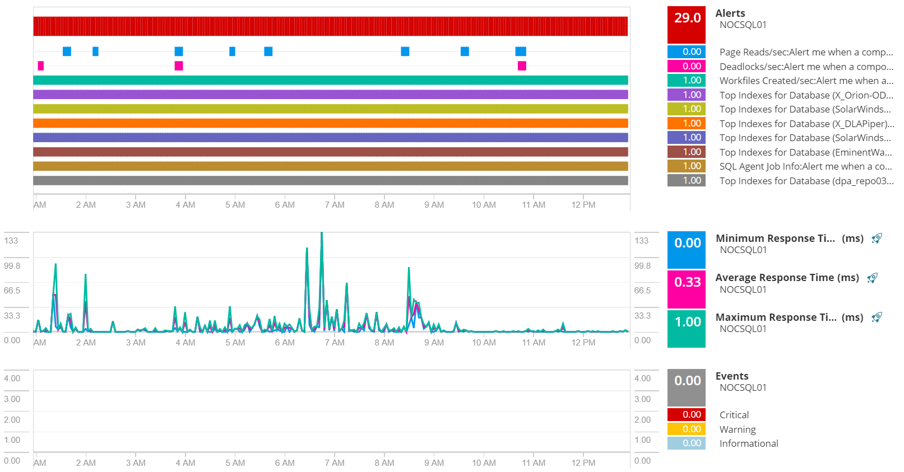
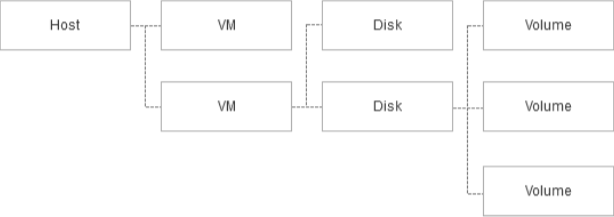
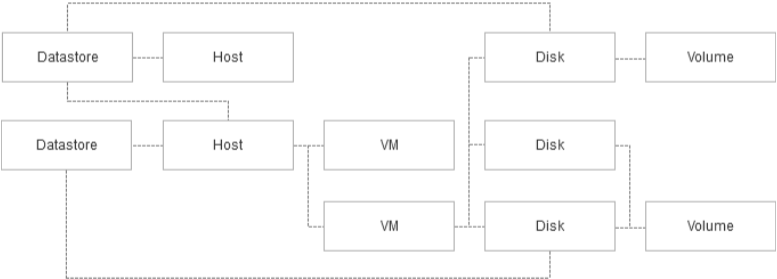
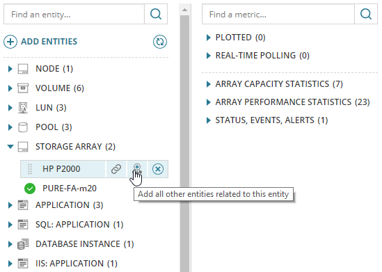

**My role:** Concept, design lead  
**Lifecycle:** New feature  
**Team size:** 5  
**Industry:** IT observability  
**Task:** Design a tool to enable rapid troubleshooting research  
**Outcome:** Broad adoption, now a core part of the SolarWinds troubleshooting story

SolarWinds Performance Analyzer (also branded as PerfStack) is a visualization 
and research tool for IT administrators working in complex,
software-defined datacenters. It was conceived as a tool for helping
users correlate and visualize time series data. It was pitched as a refresh
for the company’s aging custom chart feature.

## The Problems

**Data Sprawl** - SolarWinds monitors thousands of metrics across 28
on-premises products. This data was available through hundreds of
purpose-built dashboard widgets spread across dozens of dashboards.
Task Complexity - Creating and customizing SolarWinds dashboards is a
complex, time-consuming task which requires administrative privileges.
Many customers have specialists who build and maintain these
dashboards.

**Performance** - Over the life of the company, SolarWinds dashboards
have incrementally accumulated features. It is not uncommon for a
dashboard to have more than twenty widgets and require 5-10 seconds
to load.

## Our Responses

### Data Consolidation
Performance Analyzer pulls together nearly all time-oriented data
collected by SolarWinds products, including events, state changes, log
data, and metric observations. It presents this data as a series of stacked
swim lanes. New metrics can be dragged onto an existing lane or a new
lane.

I chose this layout to support visual correlation of data. In IT, it is often
the case that bad behavior in one place is caused by bad behavior
elsewhere. IT administrators often have several competing hypotheses
for where the “root cause” of a problem is located. The design allows
them to quickly compose a tableau of the data which might prove a
hypothesis, and then pursue or abandon it.

### Feature Democratization

All users can create, save, and share their own analysis projects. All the
data required to reconstitute a project is stored in the URL, allowing
users to copy-paste ephemeral projects into text chat, emails, or support
tickets.

Other rapid dashboard builders support many additional features
(multi-column widgets, configurable data visualizations, dynamic entity
selection, statistical tools). Performance Analyzer eschews all these in
favor of a simple find-drag-drop loop. This lets novice users test complex
hypotheses without a deep knowledge of the tool.

It’s OK to make mistakes. It’s easy to clutter up the PerfStack screen or
create incoherent or meaningless visualizations. However, it’s also easy
to undo actions and to clear out superfluous information. I wanted users
to experiment with new ways of organizing data in order to draw out new
discoveries. That means they sometimes need to head down a blind alley.
Editing is a core part of interacting with the feature. Unlike traditional
dashboards, there is no distinction between viewing and editing. Any
project can be immediately modified (though users can’t save over
someone else’s work) and the editing tools are prominently displayed.

### Question-Driven Design

Rather than showing a screen full of data, Performance Analyzer starts
with a mostly empty screen. It relies on the user having sufficient domain
expertise to pose sensible questions. It then loads just enough data to
answer that question. This allows a very fast feedback loop in which a
competent practitioner can rapidly iterate through many hypotheses.
This design is not ideal for all situations. Often users will lack the domain
knowledge to compose appropriate questions. Sometimes the system will
be able to automatically perform many parts of a task on behalf of the
user. But the task of unstructured IT troubleshooting is driven largely by
the expertise of the user and the capability of the system to provide
accurate, quick answers.

## Outcome

While not as immediately recognizable as the classic SolarWinds
dashboard, the Performance Analyzer has become a key part of the
company’s promotional materials and value proposition. Due to
customer demand, the data visualization standards and behaviors
established by Performance Analyzer are being adopted by the rest of
the SolarWinds portfolio.

User response has been positive. Many customers have reported that
non-traditional users (DBAs, help desk, managers) are finding ways to
integrate Performance Analyzer into their work.

The response has not been universally positive hower. Many users lack
the domain knowledge to compose their own hypotheses. These users
find the unstructured flow intimidating. I’ve been working to create a
better starting experience for these users. We’ve also been working on
technology improvements to help users discover adjacent lines of inquiry
when researching a problem.

## One Detail 

It is intuitive to imagine that datacenter entities are organized
hierarchically; and indeed this is often the case. A virtualization host
computer has VMs, those VMs have virtual disks, and those virtual disks
are partitioned into volumes.

However, this picture can quickly become complex. Suppose the host
shares storage with other hosts. Virtual OS disk images are on a
datastore opmized for fast reads. Applicaon data disk images are
stored on a different datastore, opmized for fault tolerance and
redundancy. Some VMs have volumes that stretch across mulple
virtual disks.

System topology starts looking more like an undirected graph.
Problems on one node of the graph oen cause problems on adjacent
nodes. For example, a heavily-loaded virtualizaon host may impair
the performance of VMs on that host. A typical part of isolang a
problem is to examine the health and load of adjacent enes.

I addressed this by adding a contextual “Add all other enes related
to this enty” buon. When clicked, this pulls in all enes that are
one hop away in the relaonship graph.

This groups the user’s environment into three buckets:
- Not related (tens of thousands) - These items are not
immediately relevant to the user’s working data set. They must
be manually selected using the “add enes” buon.
- One hop away (hundreds) - There are always a large number
of items that are one hop away from the currently-visible
poron of the graph. These items are available via the “Add all
other enes…” buon, but are not normally visible.
- Working set (a dozen) - These items are always visible on the
le side of the screen.

The three-bucket model allows users to have a reasonable working set
that can be quickly scanned and expanded on-demand.
